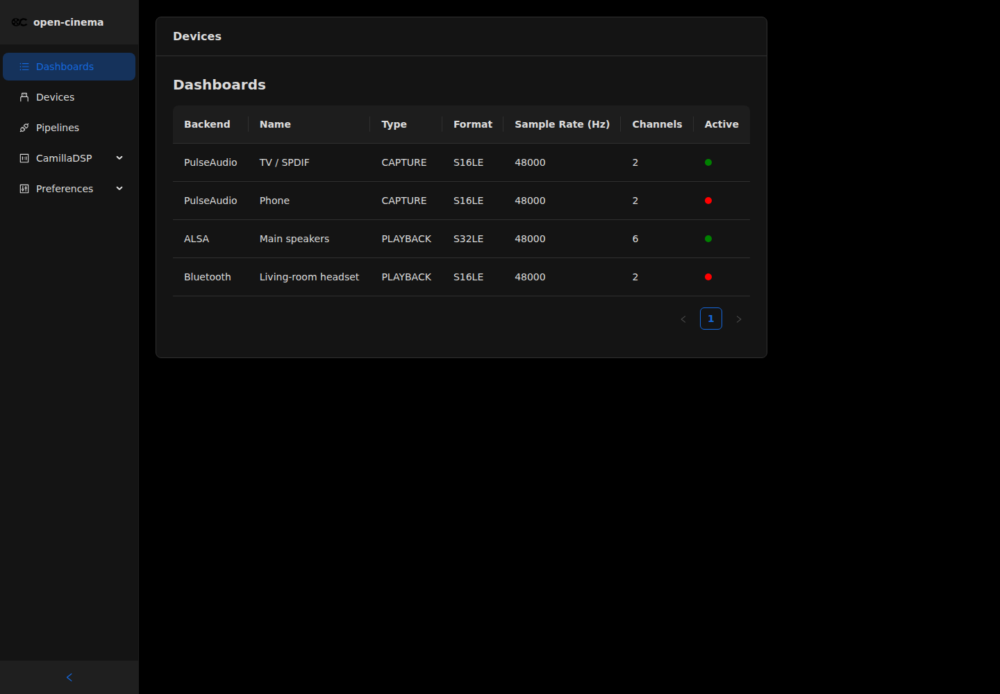
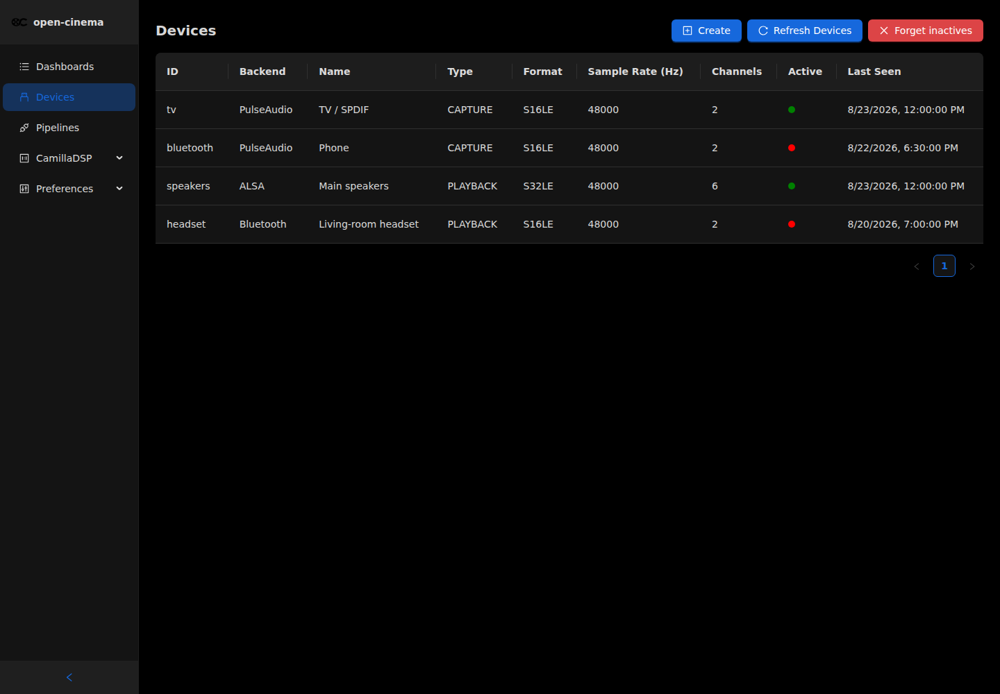
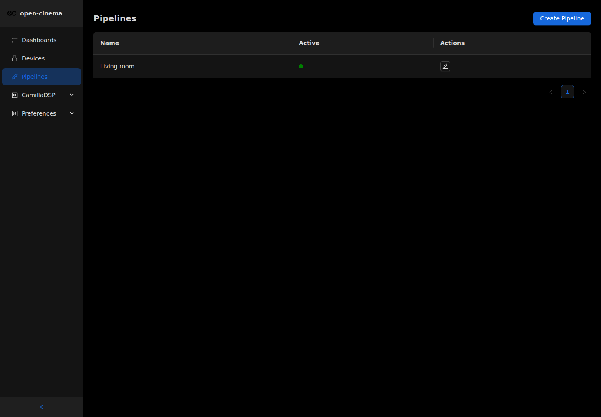
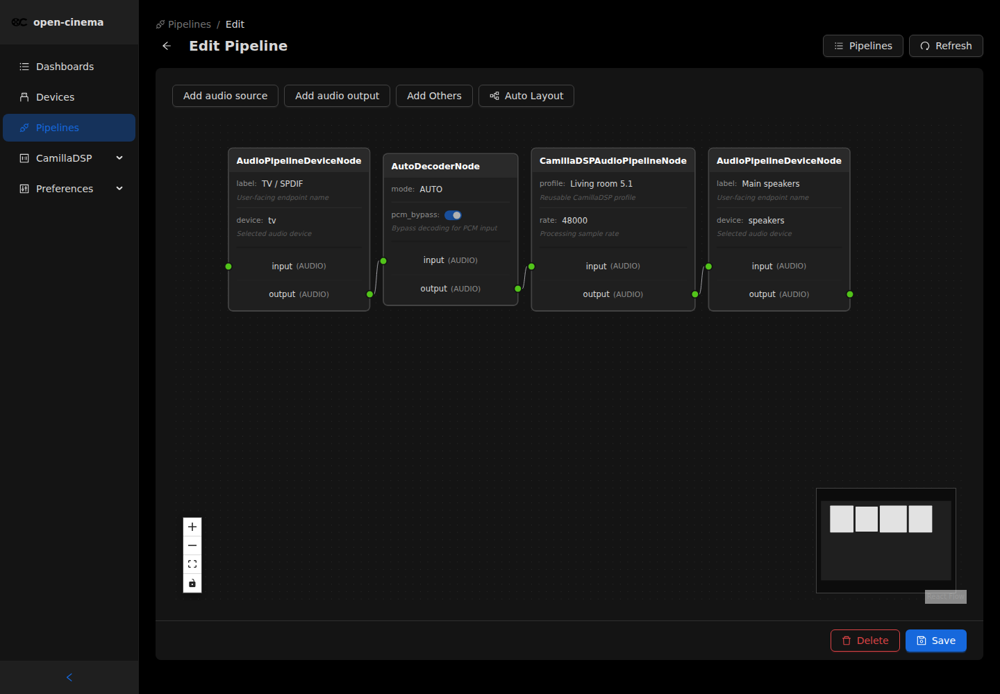
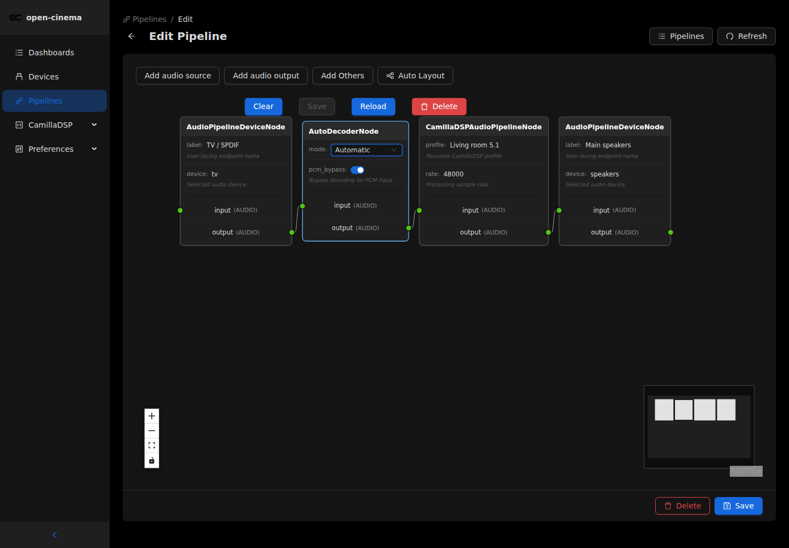

# Management UI baseline

This document records the accepted `apps/admin` experience at commit `a1933d5`
before the audio-orchestration UI is adapted to the v1 desired-graph API. It is
the visual and interaction baseline for the new work. The screenshots were
captured from an isolated worktree with representative API fixtures; no source
change was made in the product worktree to obtain them.

## Product boundaries

- `apps/admin` is the complete end-user management console. Its navigation,
  dashboard, discovery, graph authoring, processing configuration, validation,
  errors, and live-system controls remain here.
- `apps/ui` remains a small independent placeholder for the future display on
  the physical Open Cinema appliance. It must not duplicate the management
  console.
- Django admin is not an end-user UI and is not a replacement for either app.

## Established visual language

- Keep the Refine `ThemedLayout` shell and Ant Design theme, typography,
  spacing, cards, tables, alerts, forms, badges, buttons, drawers, and modals.
- Keep the compact left navigation and page-level actions at the upper right.
- Keep the graph editor as the dominant full-width surface: dark dotted canvas,
  compact dark cards, typed coloured handles, React Flow controls, minimap, and
  auto-layout.
- Keep inline node fields. Selecting a node exposes its editable controls and
  toolbar; dirty, selected, saving, validation, and error states remain visible
  in context.
- Keep discovery as a dedicated inventory table. Connected and unavailable
  resources must be distinguishable without opening the graph editor.
- Restore the existing `reactflow-custom.css` unchanged because it is part of
  the accepted graph baseline. New work must use Ant Design tokens/components,
  React Flow properties, and existing inline component styles; it must not add
  a project-specific stylesheet or new handcrafted CSS rule.
- Preserve the existing dark/light theme behavior. New orchestration states
  must use semantic labels, icons, and text as well as colour.

## Established interactions to reuse

- Page loading uses the existing centered Ant Design `Spin` pattern.
- Request and node-operation failures use the existing Ant Design message and
  error presentation, while graph validation is attached to the relevant
  field, node, edge, or graph summary.
- The graph toolbar keeps explicit add actions and auto-layout. The new palette
  may group input, output, processor, routing/control, and subgraph entries, but
  it must feel like an extension of this toolbar and canvas.
- Node selection keeps the visible Clear/Save/Reload/Delete toolbar and inline
  field editors. On v1 contracts the node-level Save interaction updates the
  local draft; the page-level **Save draft** persists the whole graph and never
  changes live audio.
- The new **Apply** action is placed beside Save draft. It provides visible
  save, validation, publish, activate, and reconciliation progress, and retains
  the established success/error feedback patterns.
- Refresh, list/edit navigation, back navigation, delete confirmation, and
  optimistic-edit conflict recovery remain explicit and reversible.

## Reference views

### Dashboard and navigation

### Device discovery

### Graph list

### Graph canvas

### Selected node and inline editing

## Review rule

Discovery and both simple and advanced graph workflows must be compared with
these views before acceptance. A review fails if the management workflows move
out of `apps/admin`, the graph canvas is replaced by a form-only experience,
inline node editing or discovery is lost, the established look and feel
regresses, or new project-specific CSS is introduced.
